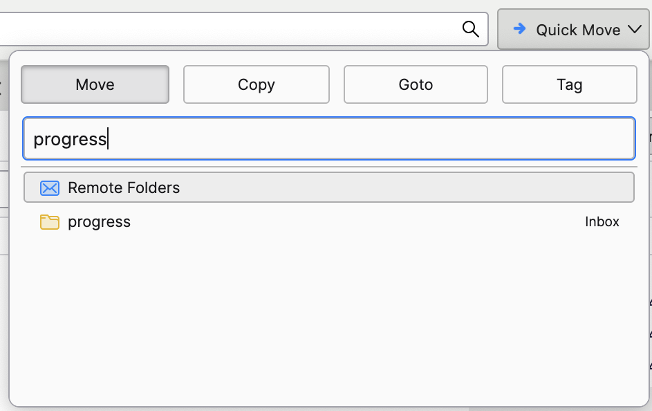

Quick Folder Move
=================

This is the source code for [Quick Folder Move](https://addons.mozilla.org/thunderbird/addon/quick-folder-move/), an add-on to quickly move emails into other folders in Thunderbird. The main purpose is to quickly triage emails using only the keyboard, but of course you can also use the mouse if you prefer.

**Cmd+Shift+M** (or Ctrl+Shift+N on Windows/Linux) opens a popup menu that allows you to move the selected messages. You can also assign keyboard shortcuts to copy, go to a folder, or apply tags via the [shortcut manager](https://support.mozilla.org/en-US/kb/manage-extension-shortcuts-firefox).

Development
-----------

As for versioning, please go ahead and bump the version number in each pull request. After 1.9 comes 2.0, even if it not a major change.

When testing, please keep in mind:
* The popup can be opened in the message display action, or the main toolbar.
* The popup can also be opened from a single message view, where the selected message is different.
* It is possible the user removed the toolbar button.
* There are different popup layouts to test on.
